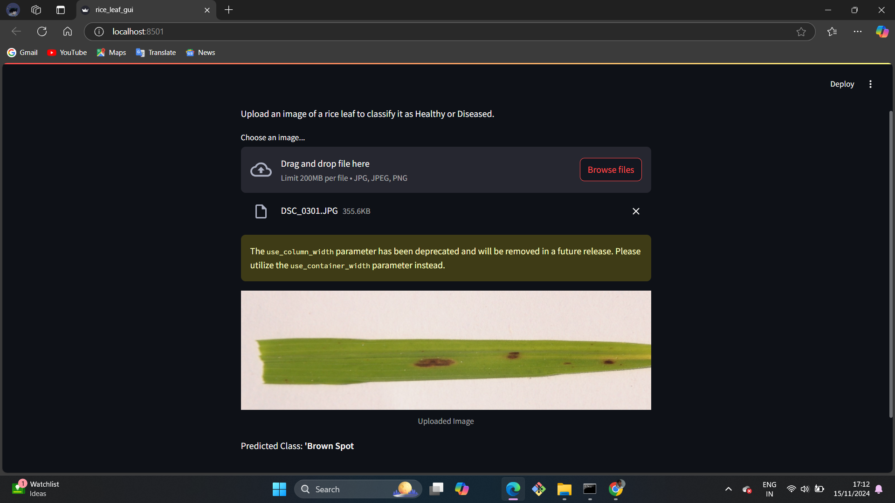

# Rice_Leaf-prediction
Designed a convolutional neural network (CNN) for detecting diseases in rice leaves from image datasets, achieving high accuracy with TensorFlow/keras
To provide more details, I will expand on key aspects of your GitHub repository for the **Rice Disease Classifier project**:

---

### **1. Expanded Folder Structure**
**Organize your repository to improve readability and usability**:
```
rice-disease-classifier/
├── models/
│   └── rice-disease-classifier.h5   # Pre-trained model
├── notebooks/
│   └── rice-disease-classifier.ipynb  # Jupyter Notebook for data exploration, training, and evaluation
├── app/
│   └── rice_leaf_gui.py             # Streamlit app for GUI-based classification
├── images/
│   ├── example.jpg                  # Example images for README or testing
│   ├── healthy_leaf.jpg             # Add a labeled image of a healthy rice leaf
│   └── diseased_leaf.jpg            # Add a labeled image of a diseased leaf
├── dataset/
│   └── rice_leaf_disease_dataset/   # (Optional) Dataset used for training/testing
├── requirements.txt                 # Python dependencies
├── README.md                        # Main project description
├── LICENSE                          # License for your repository
└── .gitignore                       # List of files/folders to ignore in Git
```

---

### **2. Detailed File Explanations**

#### **`models/rice-disease-classifier.h5`**
- **Purpose**: Stores the trained Convolutional Neural Network (CNN).
- **Details**:
  - The model is built using Keras/TensorFlow.
  - Optimized for multi-class classification with softmax activation.
  - Trained on a dataset of labeled rice leaf images.

#### **`notebooks/rice-disease-classifier.ipynb`**
- **Purpose**: Demonstrates the model development pipeline.
- **Contents**:
  - **Data Loading**:
    - Load image data and preprocess it into train-test splits.
  - **Data Augmentation**:
    - Apply techniques like rotation, flipping, and zooming for robust training.
  - **Model Architecture**:
    - CNN layers such as Conv2D, MaxPooling2D, Flatten, Dense.
    - Batch Normalization and Dropout for better generalization.
  - **Training**:
    - Train the model with appropriate optimizer and loss function.
    - Plot metrics such as accuracy and loss curves.
  - **Evaluation**:
    - Display confusion matrix and classification report.
    - Save the trained model to `rice-disease-classifier.h5`.

#### **`app/rice_leaf_gui.py`**
- **Purpose**: Simplifies disease classification using a GUI.
- **Features**:
  - Upload rice leaf images in `.jpg`, `.jpeg`, or `.png` formats.
  - Real-time predictions with disease names as output.
  - Uses the pre-trained model (`rice-disease-classifier.h5`).
  - Displays the uploaded image and prediction result.

#### **`requirements.txt`**
A text file listing all Python dependencies required for the project. Example content:
```plaintext
streamlit==1.24.0
tensorflow==2.12.0
pillow==9.5.0
numpy==1.23.5
```

You can generate this file dynamically using:
```bash
pip freeze > requirements.txt
```

#### **`README.md`**
This is the heart of your repository, providing detailed information for users:
- **Introduction**: What the project does and why it matters.
- **Features**:
  - Identifies rice leaf diseases quickly and accurately.
  - Easy-to-use interface powered by Streamlit.
  - Supports real-time image classification.
- **Installation**: Step-by-step setup guide.
- **Usage**: Example commands and screenshots of the app in action.
- **Dataset**: Mention the source of the training dataset.
- **Future Improvements**:
  - Add support for additional diseases.
  - Improve model accuracy.
- **Acknowledgments**: Credit datasets, libraries, and resources.

#### **`LICENSE`**
Choose a license (e.g., MIT, Apache 2.0) and include the content in this file. MIT is a common choice for open-source projects:
```plaintext
MIT License
Copyright (c) 2024 [Your Name]
Permission is hereby granted, free of charge, to any person obtaining a copy...
```

#### **`.gitignore`**
List the files and folders Git should ignore:
```plaintext
__pycache__/
*.h5
*.pyc
*.pyo
.DS_Store
.vscode/
```

---

### **3. Dataset Information**
If your project relies on a publicly available dataset:
- **Provide details in the README**:
  - Source: Include a link or citation for the dataset.
  - Format: Describe the folder structure and file formats (e.g., `.jpg` images categorized by disease type).
  - Example:
    ```
    Dataset structure:
    rice_leaf_disease_dataset/
    ├── Leaf_Blight/
    │   ├── image1.jpg
    │   ├── image2.jpg
    ├── Brown_Spot/
    ├── Leaf_Smut/
    └── Healthy/
    ```
- **If the dataset is private**, mention how users can generate or access similar data.

---

### **4. Advanced Features to Consider**
#### **Add Deployment Guide**:
- Host the Streamlit app on platforms like **Streamlit Cloud**, **Heroku**, or **AWS**.
- Add deployment instructions in the README:
  ```bash
  streamlit run app/rice_leaf_gui.py
  ```

#### **Add Unit Tests**:
Include tests to validate the model and app behavior:
- Write test scripts in Python using `pytest` or similar libraries.
- Example:
  ```python
  def test_preprocess_image():
      image = Image.open("test_image.jpg")
      processed = preprocess_image(image)
      assert processed.shape == (1, 224, 224, 3)
  ```

#### **Add Visualizations**:
- In the notebook, plot confusion matrix and ROC curve.
- In the app, add confidence scores for predictions.

---



